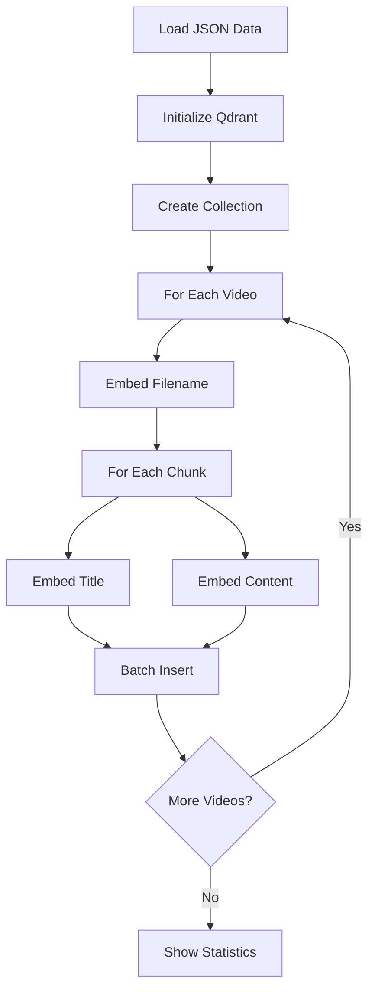

# Hierarchical Indexer

## Overview
Builds a sophisticated 3-layer hierarchical vector index using Qdrant for semantic search. This script creates embeddings at multiple levels of granularity (filename, title, content) to enable precise and efficient knowledge retrieval in the MoshrifAI system.

## Purpose
Transform semantically chunked content into a searchable vector database:
- **Multi-Layer Indexing**: Creates 3 levels of searchable embeddings
- **Semantic Search**: Enables finding relevant content by meaning, not keywords
- **Hierarchical Retrieval**: Allows searching at different abstraction levels
- **Efficient Storage**: Optimizes for fast similarity search with Qdrant

## Architecture

### 3-Layer Hierarchy

```
Layer 1: Filename Embeddings
    ↓ (1 embedding per video)
    │
    ├─→ Layer 2: Title Embeddings
    │       ↓ (1 embedding per chunk)
    │
    └─→ Layer 3: Content Embeddings
            ↓ (1 embedding per chunk)
```

**Layer 1 - Filename**: Video-level search (e.g., "Introduction to AI")  
**Layer 2 - Title**: Topic-level search (e.g., "Definition of Machine Learning")  
**Layer 3 - Content**: Detailed content search (e.g., specific concepts within topics)

## Requirements

### Software Requirements
- **Python**: 3.7 or higher

### Python Dependencies
```bash
pip install qdrant-client==1.16.1 requests==2.31.0
```

### External Services

#### Embedding Service
This script requires a **local embedding API** running on port 8000:
- **Endpoint**: `http://127.0.0.1:8000/embed`
- **Model**: Must produce **1024-dimensional** vectors
- **Expected Response**: `{"embedding": [float, float, ...]}`

> [!IMPORTANT]
> Start your embedding service before running this script!

## Configuration

### File Paths
```python
DATA_PATH = Path("Moshrif-knowledge-chunks.json")
QDRANT_PATH = "qdrant_db_hierarchical"
EMBEDDING_URL = "http://127.0.0.1:8000/embed"
```

### Vector Configuration
```python
VECTOR_SIZE = 1024
COLLECTION_NAME = "moshrif_knowledge_v3"
BATCH_SIZE = 64
```

### Input Data Format

The script expects JSON with this structure:
```json
[
  {
    "id": 1,
    "filename": "video_title",
    "telegram_url": "https://t.me/...",
    "chunks": [
      {
        "chunk_id": 1,
        "topicTitle": "Topic Title",
        "topicContent": "Detailed content..."
      }
    ]
  }
]
```

## How It Works

### Indexing Process



### Embedding Types

Each point in the database has an `embedding_type` field:

| Type | Description | Count per Video | Searchable For |
|------|-------------|-----------------|----------------|
| `filename` | Video-level | 1 | Video discovery |
| `title` | Chunk title | N (# of chunks) | Topic navigation |
| `content` | Full chunk | N (# of chunks) | Detailed answers |

### Payload Structure

Each vector point stores:
```python
{
    "video_id": int,           # Original video ID
    "filename": str,           # Video filename
    "telegram_url": str,       # Source URL
    "chunk_id": int or None,   # Chunk ID (None for filename)
    "chunk_title": str,        # Topic title (empty for filename)
    "chunk_content": str,      # Full content (empty for filename)
    "embedding_type": str      # "filename", "title", or "content"
}
```

## Usage

### Prerequisites

1. **Prepare your data**:
   - Run Semantic Chunker to create chunked JSON
   - Ensure file is named `Moshrif-knowledge-chunks.json`

2. **Start embedding service**:
   ```bash
   # Example: Start FastAPI embedding service
   cd Embedding_Service
   python main.py
   ```
   Verify it's running:
   ```bash
   curl http://127.0.0.1:8000/embed -X POST -H "Content-Type: application/json" -d '{"text":"test"}'
   ```

### Running the Indexer

```bash
python build_hierarchical_index.py
```

### Example Output

```
📂 Loading data from Moshrif-knowledge-chunks.json...
✅ Loaded 100 videos

🔨 Recreating collection: moshrif_knowledge_v3
✅ Collection created successfully

📊 Processing 100 videos...

[1/100] Video ID=1, Chunks=5
  📁 Creating filename embedding...
    ✅ Inserted batch of 64 points

[2/100] Video ID=2, Chunks=3
  📁 Creating filename embedding...
...

🎉 Finished indexing! Total points: 523

📊 Collection Stats:
   Total points: 523
   Vector size: 1024
   Distance: Cosine

⏱️  Total time: 145.3 seconds
```

## Features

### Batch Processing
- ✅ **Efficient Uploads**: Inserts in batches of 64 points
- ✅ **Progress Tracking**: Shows detailed processing status
- ✅ **Error Handling**: Graceful handling of empty content

### Automatic Fallbacks
- ✅ **Empty Text**: Returns zero vectors for empty strings
- ✅ **Missing Chunks**: Skips videos without chunks
- ✅ **Missing Titles**: Skips title embedding if title is empty

### Database Management
- ✅ **Collection Recreation**: Automatically recreates collection
- ✅ **Schema Validation**: Ensures correct vector dimensions
- ✅ **Statistics Display**: Shows final index metrics

## Querying the Index

### Search by Layer

**Layer 1 - Find Relevant Videos**:
```python
from qdrant_client import QdrantClient

client = QdrantClient(path="qdrant_db_hierarchical")

# Search for videos about a topic
results = client.search(
    collection_name="moshrif_knowledge_v3",
    query_vector=get_embedding("artificial intelligence"),
    query_filter={
        "must": [{"key": "embedding_type", "match": {"value": "filename"}}]
    },
    limit=5
)
```

**Layer 2 - Find Relevant Topics**:
```python
results = client.search(
    collection_name="moshrif_knowledge_v3",
    query_vector=get_embedding("machine learning basics"),
    query_filter={
        "must": [{"key": "embedding_type", "match": {"value": "title"}}]
    },
    limit=10
)
```

**Layer 3 - Detailed Content Search**:
```python
results = client.search(
    collection_name="moshrif_knowledge_v3",
    query_vector=get_embedding("deep neural networks"),
    query_filter={
        "must": [{"key": "embedding_type", "match": {"value": "content"}}]
    },
    limit=20
)
```

### Multi-Layer Retrieval

Search across all layers simultaneously:
```python
results = client.search(
    collection_name="moshrif_knowledge_v3",
    query_vector=get_embedding("user query"),
    limit=50  # Returns best matches across all layers
)
```

## Integration with MoshrifAI

This is the final step in the MoshrifAI data pipeline:

1. **Telegram Downloader**: Downloads raw transcripts
2. **URL Fixer**: Ensures metadata completeness
3. **Semantic Chunker**: Splits into semantic units
4. **This Script**: Creates searchable vector index ✓
5. **Orchestrator**: Uses the index for retrieval

## Performance Optimization

### Indexing Speed
- **Batch Size**: Adjust `BATCH_SIZE` (default: 64)
  - Larger = Faster but more memory
  - Smaller = Slower but stable
- **Embedding API**: Ensure low latency (<100ms per request)
- **Disk I/O**: Use SSD for Qdrant storage

### Search Speed
- **Collection Size**: Cosine distance is optimized for large collections
- **HNSW Indexing**: Qdrant automatically uses HNSW for fast search
- **Filters**: Pre-filter by `embedding_type` for layer-specific search

## Troubleshooting

### Embedding Service Errors

**Problem**: "Connection refused"  
**Solution**: 
- Verify embedding service is running on port 8000
- Check firewall settings
- Test with curl/Postman

**Problem**: "Vector dimension mismatch"  
**Solution**:
- Ensure embedding service returns 1024-dimensional vectors
- Check `VECTOR_SIZE` configuration
- Verify model compatibility

### Data Format Errors

**Problem**: "No chunks found"  
**Solution**:
- Verify input JSON has `chunks` array
- Check that Semantic Chunker completed successfully
- Ensure chunks contain `topicTitle` and `topicContent`

**Problem**: "File not found"  
**Solution**:
- Check `DATA_PATH` points to correct file
- Ensure file is in same directory as script
- Use absolute path if necessary

### Qdrant Errors

**Problem**: "Collection already exists"  
**Solution**: Script uses `recreate_collection()` which should handle this automatically

**Problem**: "Disk space full"  
**Solution**:
- Check available disk space
- Clean old Qdrant databases
- Reduce dataset size for testing

## Advanced Configuration

### Custom Collection Settings

Modify `init_collection()` for advanced features:

```python
client.recreate_collection(
    collection_name=COLLECTION_NAME,
    vectors_config=models.VectorParams(
        size=VECTOR_SIZE,
        distance=models.Distance.COSINE,
        on_disk=True,  # Store vectors on disk (slower, less memory)
    ),
    hnsw_config=models.HnswConfigDiff(
        m=16,           # HNSW parameter
        ef_construct=100  # Build-time accuracy
    ),
)
```

### Batch Size Tuning

Based on your system:
- **RAM < 8GB**: `BATCH_SIZE = 32`
- **RAM 8-16GB**: `BATCH_SIZE = 64` (default)
- **RAM > 16GB**: `BATCH_SIZE = 128`

### Processing Subsets

To index only specific videos:
```python
data = [v for v in data if v['id'] in target_ids]
```

## Monitoring & Metrics

### Index Statistics
```python
collection_info = client.get_collection("moshrif_knowledge_v3")
print(f"Points: {collection_info.points_count}")
print(f"Vectors: {collection_info.vectors_count}")
print(f"Indexed: {collection_info.status}")
```

### Estimated Sizes
- **1 video** (5 chunks) = ~11 points (1 filename + 5 titles + 5 contents)
- **100 videos** (avg 5 chunks) = ~1,100 points
- **1024-dim vector** = ~4KB per point
- **1,000 points** = ~4MB storage (uncompressed)

## Notes

> [!IMPORTANT]
> - The collection is **recreated** each time you run the script
> - All existing data in the collection will be deleted
> - Always keep backups of your source JSON files

> [!TIP]
> - Run indexing during off-peak hours for large datasets
> - Monitor memory usage during batch inserts
> - Use SSD storage for better Qdrant performance

> [!WARNING]
> - Empty text generates zero vectors (may affect search quality)
> - Ensure embedding service is stable before indexing large datasets
> - Verify vector dimensions match between embedding service and Qdrant config

## Resources

- [Qdrant Documentation](https://qdrant.tech/documentation/)
- [HNSW Algorithm](https://arxiv.org/abs/1603.09320)
- [Cosine Similarity](https://en.wikipedia.org/wiki/Cosine_similarity)
- [Vector Search Best Practices](https://qdrant.tech/documentation/guides/optimize/)
