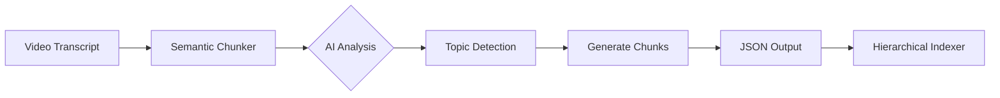

# Semantic Chunker

## Overview
AI-powered semantic text chunking tool using Google's Gemini 2.5 Pro model. This script analyzes video transcripts and intelligently splits them into meaningful semantic chunks based on topic boundaries, rather than arbitrary character or sentence limits.

## Purpose
Transform long, unstructured video transcripts into well-organized, semantically coherent chunks:
- **Intelligent Splitting**: Breaks text only when topics change drastically
- **Contextual Analysis**: Uses advanced AI to understand content flow
- **Q&A Detection**: Separates question-answer pairs automatically
- **Topic Titling**: Generates descriptive Arabic titles for each chunk
- **Structured Output**: Produces clean JSON with chunk metadata

## Requirements

### Software Requirements
- **Python**: 3.7 or higher

### Python Dependencies
```bash
pip install google-generativeai==0.3.0
```

### API Requirements
- **Google AI API Key**: Required for Gemini model access
- Get your API key from: [Google AI Studio](https://makersuite.google.com/app/apikey)

## Configuration

### API Key Setup

> [!IMPORTANT]
> **Security Best Practice**: Do not hardcode API keys in the script. Use environment variables instead.

**Option 1: Environment Variable (Recommended)**
```bash
# Windows PowerShell
$env:GOOGLE_API_KEY="your_api_key_here"

# Linux/Mac
export GOOGLE_API_KEY="your_api_key_here"
```

Then update the script:
```python
import os
API_KEY = os.getenv("GOOGLE_API_KEY")
genai.configure(api_key=API_KEY)
```

**Option 2: Config File**
Create a `config.json`:
```json
{
  "google_api_key": "your_api_key_here"
}
```

### Model Configuration
The script uses `gemini-2.5-pro` for maximum accuracy:
```python
model = genai.GenerativeModel('gemini-2.5-pro')
```

### Processing Parameters
- **Temperature**: `0.0` (deterministic output)
- **Max Retries**: `3` (handles JSON parsing failures)
- **Rate Limit Delay**: `15 seconds` between requests
- **Text Limit**: First `30,000` characters per video

## Usage

### Input File Format
The script expects a JSON file with this structure:
```json
[
  {
    "id": 1,
    "filename": "video_title",
    "telegram_url": "https://t.me/...",
    "content": "Full video transcript..."
  }
]
```

### Running the Script

1. **Configure input/output paths**:
   ```python
   process_large_file(
       r'G:\MyProjects\Moshrif Project\Moshrif_Knowledge.json',
       'Moshrif_Analyzed_ProV4.json'
   )
   ```

2. **Run the script**:
   ```bash
   python Semantic_chunker.py
   ```

3. **Monitor progress**:
   - Script shows processing status for each video
   - Automatically saves progress every 2 videos
   - Handles errors with fallback chunks

### Example Output

```
🚀 Starting High-Accuracy AI Analysis (Gemini 2.5 Flash)...
[1/100] 🔄 Analyzing Video ID: 216...
💾 Progress saved.
[2/100] 🔄 Analyzing Video ID: 217...
✅ Done! Full high-accuracy processing complete.
```

## Output Format

### Processed JSON Structure
```json
[
  {
    "id": 1,
    "filename": "video_title",
    "telegram_url": "https://t.me/...",
    "chunks": [
      {
        "chunk_id": 1,
        "topicTitle": "المقدمة والترحيب",
        "topicContent": "Text segment of the first topic..."
      },
      {
        "chunk_id": 2,
        "topicTitle": "شرح المفهوم الأساسي",
        "topicContent": "Text segment of the second topic..."
      }
    ]
  }
]
```

## Features

### Intelligent Chunking
- ✅ **Topic Detection**: Identifies when speaker changes subjects
- ✅ **Q&A Separation**: Automatically splits question-answer pairs
- ✅ **Lecture Structuring**: Organizes by chapters/concepts
- ✅ **Arabic Titles**: Generates descriptive topic titles in Arabic

### Reliability Features
- ✅ **Retry Mechanism**: Up to 3 attempts for failed requests
- ✅ **Error Logging**: Saves failed videos to separate files
- ✅ **Fallback Chunks**: Returns partial results on complete failure
- ✅ **Auto-save**: Periodic progress saves to prevent data loss

### Performance Optimizations
- ✅ **Rate Limiting**: Built-in delays to respect API limits
- ✅ **Batch Processing**: Handles large datasets efficiently
- ✅ **Progress Tracking**: Visual feedback during processing

## Error Handling

### JSON Parsing Errors
If Gemini returns invalid JSON:
- Script retries up to 3 times automatically
- Final failure saves error details to `failed_video_{id}.txt`
- Returns fallback chunk with first 10,000 characters

### API Rate Limits
If you encounter 429 errors:
- Increase `time.sleep(15)` to 20-30 seconds
- Consider processing in smaller batches
- Check your API quota limits

### Sample Error File
```
Video ID: 216
Error: JSONDecodeError: Expecting value...
Attempts: 3

--- Raw Response ---
[Gemini's raw output here]
```

## Selective Processing

The script includes filtering logic to process specific videos:
```python
if video_id not in (216, 217, 218):
    print(f"⏭️ Skipping Video ID: {video_id}")
    continue
```

**To process all videos**, remove or modify this filter.

## Integration with MoshrifAI

This tool is part of the MoshrifAI content processing pipeline:
1. **Input**: JSON from Telegram Downloader or URL Fixer
2. **Processing**: This script → Semantic chunks
3. **Output**: Structured chunks ready for embedding
4. **Next Step**: Hierarchical indexer creates vector embeddings

## Troubleshooting

### "API Key not valid"
- Verify your API key is correct
- Check that the key has Gemini API access enabled
- Ensure the key is not expired or rate-limited

### "Rate limit exceeded"
- Increase delay between requests (line 133)
- Reduce batch size
- Wait and retry later

### "JSON Decode Error"
- Check the `failed_video_*.txt` files for raw output
- Verify Gemini model is returning valid JSON
- Consider updating prompt for clearer JSON format

### Memory Issues
- Process smaller batches of videos
- Reduce `text[:30000]` limit if needed
- Clear variables between iterations

## Performance Tips

> [!TIP]
> - **Faster Processing**: Use `gemini-1.5-flash` instead of Pro (less accurate)
> - **Better Accuracy**: Keep temperature at 0.0 for consistent results
> - **Cost Optimization**: Process only new/updated videos
> - **Resume Processing**: Script auto-saves progress every 2 videos

## Cost Considerations

Google Gemini API pricing (as of 2024):
- **gemini-2.5-pro**: Higher cost, best accuracy
- **gemini-1.5-flash**: Lower cost, faster, good accuracy
- Check current pricing: [Google AI Pricing](https://ai.google.dev/pricing)

## Advanced Usage

### Custom Prompts
Modify the prompt in `get_semantic_chunks()` to:
- Change chunking strategy
- Adjust title language (Arabic/English)
- Add metadata fields
- Customize output format

### Batch Configuration
Adjust these parameters based on your needs:
```python
max_retries=3          # Retry attempts
temperature=0.0        # Output randomness
text[:30000]          # Characters per request
time.sleep(15)        # Rate limit delay
```

## Example Workflow



## Notes

> [!WARNING]
> - This script makes external API calls that may incur costs
> - Ensure you have sufficient API quota before processing large datasets
> - Always backup original data before processing

> [!CAUTION]
> - Never commit API keys to version control
> - Use environment variables or secure config management
> - Monitor API usage to avoid unexpected charges
