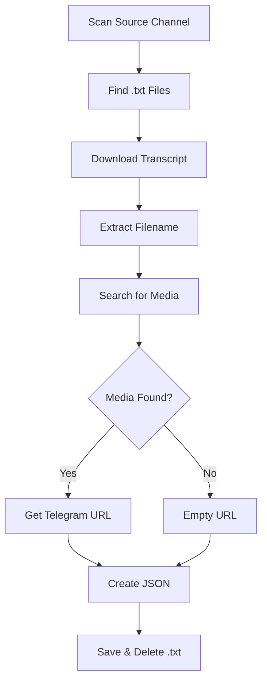

# Telegram Downloader

## Overview
Automated Telegram content downloader that retrieves text transcripts and links them to their corresponding media files (videos/audio). This script searches across Telegram channels, matches content, and exports organized JSON files with all metadata.

## Purpose
Streamline the process of downloading and organizing Telegram channel content:
- **Automated Download**: Fetches text files from source channels
- **Media Matching**: Finds corresponding videos/audio files
- **Smart Search**: Uses normalized text matching for accuracy
- **JSON Export**: Creates structured data files
- **Batch Processing**: Handles multiple files automatically

## Requirements

### Software Requirements
- **Python**: 3.7 or higher

### Python Dependencies
```bash
pip install telethon==1.24.0
```

### Telegram API Credentials

> [!IMPORTANT]
> You need Telegram API credentials to use this script. Get them from [my.telegram.org/apps](https://my.telegram.org/apps)

**Required credentials:**
- `api_id` - Your application's API ID
- `api_hash` - Your application's API Hash

### First-Time Setup
On first run, the script will:
1. Ask for your phone number
2. Send a verification code to Telegram
3. Create a session file for future use

## Configuration

### API Credentials Setup

> [!CAUTION]
> **Security Warning**: Never hardcode credentials or commit them to version control!

**Option 1: Environment Variables (Recommended)**
```bash
# Windows PowerShell
$env:TELEGRAM_API_ID="your_api_id"
$env:TELEGRAM_API_HASH="your_api_hash"

# Linux/Mac
export TELEGRAM_API_ID="your_api_id"
export TELEGRAM_API_HASH="your_api_hash"
```

Update the script:
```python
import os
api_id = int(os.getenv("TELEGRAM_API_ID"))
api_hash = os.getenv("TELEGRAM_API_HASH")
```

**Option 2: Config File**
Create `config.json`:
```json
{
  "telegram_api_id": 12345678,
  "telegram_api_hash": "your_hash_here"
}
```

### Channel Configuration
```python
# Source channel for text transcripts
SOURCE_CHANNEL = "https://t.me/moshrif_knowledge"

# Channels to search for media files
ALLOWED_CHANNELS = ["moshrif_youtube"]

# Output directory
OUTPUT_FOLDER = "downloaded"
```

## How It Works

### Workflow



### Text Normalization
The script uses smart text normalization to improve matching:
- **Case Insensitive**: Converts to lowercase
- **Extension Removal**: Strips `.txt`, `.mp4`, etc.
- **Arabic Normalization**: Standardizes hamza characters (أ, إ, آ → ا)
- **Symbol Removal**: Removes `_`, `-`, `.`, `;`, `,`
- **Whitespace**: Normalizes multiple spaces

**Example:**
```
"فيديو_المقدمة.txt" → "فيديو المقدمة"
"Intro-Video.MP4" → "intro video"
```

### Media Priority
When searching for matching media, the script prioritizes:
1. **Videos** (`.mp4`, `.mkv`, `.mov`, `.avi`)
2. **Audio** (`.mp3`, `.m4a`, `.ogg`)

## Usage

### Basic Usage

1. **Configure channels and paths**:
   Edit the script to set your source and target channels

2. **Run the script**:
   ```bash
   python Telegram_Downloader.py
   ```

3. **First-time authentication**:
   - Enter your phone number (with country code)
   - Enter the verification code from Telegram
   - Session will be saved for future runs

4. **Monitor progress**:
   ```
   [+] Logged in successfully
   
   [+] Processing video_001.txt
   [+] Downloaded: downloaded/video_001.txt
   [~] Searching for media using: video 001
   [+] Media Found: https://t.me/moshrif_youtube/123
   [✔] Saved JSON: downloaded/video_001.json
   ```

### Output Structure

Each processed file generates a JSON with this structure:
```json
{
  "filename": "clean_video_name",
  "telegram_url": "https://t.me/channel/message_id",
  "content": "Full text transcript from the .txt file"
}
```

## Features

### Smart Matching
- ✅ **Fuzzy Matching**: Handles filename variations
- ✅ **Multiple Search**: Checks message text AND filename
- ✅ **Channel Filtering**: Only searches specified channels
- ✅ **Media Type Detection**: Prioritizes video over audio

### Link Extraction
- ✅ **Public Channels**: Creates `t.me/username/id` links
- ✅ **Private Channels**: Creates `t.me/c/channel_id/id` links
- ✅ **Message Context**: Preserves exact message reference

### File Management
- ✅ **Auto-cleanup**: Deletes .txt files after JSON creation
- ✅ **UTF-8 Support**: Handles Arabic and Unicode properly
- ✅ **Pretty JSON**: Formatted with indentation
- ✅ **Progress Feedback**: Clear status messages

## Advanced Configuration

### Search Limits
Modify the search limit in `global_search()`:
```python
async for msg in client.iter_messages(None, search=query_norm, limit=50):
```
Increase `limit=50` to search more messages (slower but more thorough)

### Custom File Types
To add support for other file types, modify the MIME type checks:
```python
if mime.startswith("video"):  # Video files
if mime.startswith("audio"):  # Audio files
if mime.startswith("document"):  # Documents
```

### Multiple Source Channels
Process from multiple channels:
```python
SOURCE_CHANNELS = [
    "https://t.me/channel1",
    "https://t.me/channel2"
]

for channel in SOURCE_CHANNELS:
    async for msg in client.iter_messages(channel):
        # processing logic
```

## Integration with MoshrifAI

This tool is the first step in the MoshrifAI pipeline:
1. **This Script**: Download transcripts + media URLs
2. **URL Fixer**: Fill any missing URLs
3. **Semantic Chunker**: Split into topics
4. **Hierarchical Indexer**: Create vector embeddings

## Troubleshooting

### Authentication Errors
**Problem**: "Phone number invalid"  
**Solution**: Include country code (e.g., `+1234567890`)

**Problem**: "Session file corrupted"  
**Solution**: Delete `session.session` and re-authenticate

### Channel Access Errors
**Problem**: "Can't access channel"  
**Solution**: 
- Ensure you're a member of the channel
- Check channel username is correct
- Verify channel is not restricted

### No Media Found
**Problem**: All URLs are empty  
**Solution**:
- Check that media exists in `ALLOWED_CHANNELS`
- Verify channel name is correct
- Increase search limit
- Check text normalization is working

### Rate Limiting
**Problem**: "FloodWaitError"  
**Solution**:
- Add delays between requests
- Reduce batch size
- Wait and retry later

### File Encoding Errors
**Problem**: "UnicodeDecodeError"  
**Solution**:
- Ensure files use UTF-8 encoding
- Add `errors='ignore'` parameter to file read

## Performance Tips

> [!TIP]
> - **Session Reuse**: Keep the `session.session` file for faster authentication
> - **Batch Processing**: Process during off-peak hours to avoid rate limits
> - **Selective Processing**: Filter by date or message ID to avoid re-processing
> - **Parallel Channels**: Run multiple instances for different channels

## Security Best Practices

> [!WARNING]
> - Never share your `session.session` file (it contains auth tokens)
> - Don't commit API credentials to Git repositories
> - Use `.gitignore` for sensitive files:
>   ```
>   session.session
>   config.json
>   *.env
>   ```

## Example Scenarios

### Scenario 1: Full Channel Download
Download all content from a channel:
```python
SOURCE_CHANNEL = "https://t.me/your_channel"
ALLOWED_CHANNELS = ["media_channel_1", "media_channel_2"]
```

### Scenario 2: Selective Download
Process only specific files (modify the loop):
```python
target_files = ["file1.txt", "file2.txt"]
if msg.file and msg.file.name in target_files:
    # process
```

### Scenario 3: Resume After Interruption
Skip already processed files:
```python
import os
processed = set(f.replace('.json', '') for f in os.listdir(OUTPUT_FOLDER) if f.endswith('.json'))

if name_no_ext not in processed:
    # process
```

## Notes

> [!IMPORTANT]
> - Respect Telegram's rate limits to avoid account restrictions
> - Ensure you have permission to download content from channels
> - Large channels may take hours to process completely
> - Monitor disk space when downloading many files

## API Limits

Telegram API limits (unofficial, may vary):
- **Messages per second**: ~30
- **Flood wait**: 10-60 seconds if exceeded
- **Session lifetime**: Permanent until revoked
- **File download size**: No practical limit

For official limits, see: [Telegram API Documentation](https://core.telegram.org/api/obtaining_api_id)
