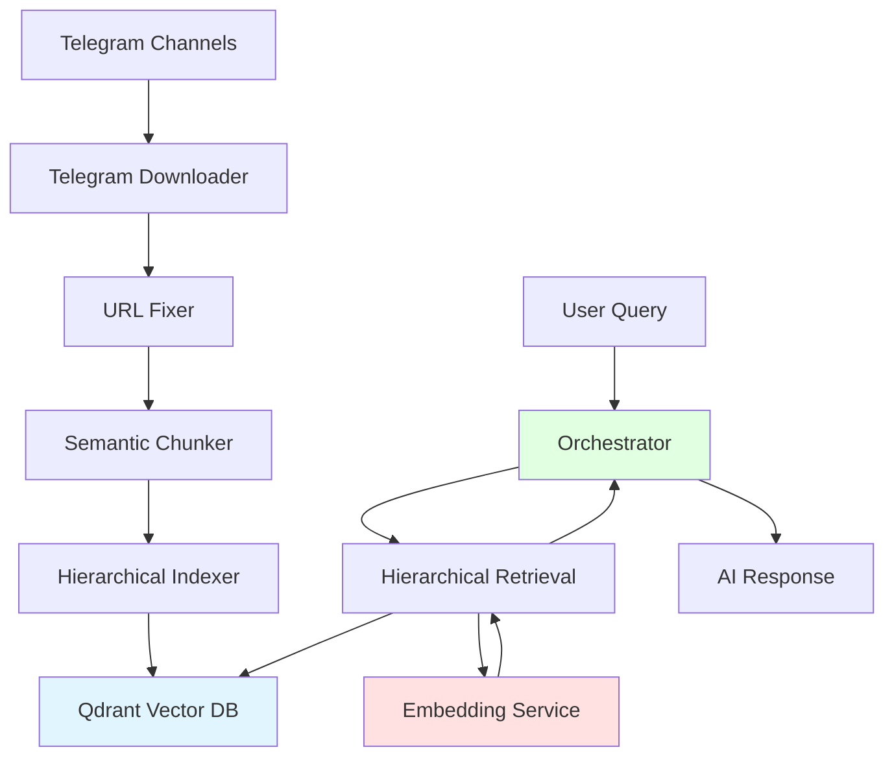

# MoshrifAI

**Advanced AI-Powered Knowledge Retrieval System**

MoshrifAI is a comprehensive semantic search and knowledge retrieval system that leverages hierarchical vector embeddings and intelligent retrieval strategies to provide accurate, context-aware answers from video content knowledge bases.

---

## 🎯 Overview

MoshrifAI transforms video transcripts into a searchable knowledge base using:
- **Semantic Chunking**: AI-powered topic segmentation
- **Multi-Layer Embeddings**: Hierarchical vector indexing (filename → title → content)
- **Intelligent Retrieval**: Context-aware search with Arabic language support
- **Scalable Architecture**: Modular design for easy maintenance and extension

## 🏗️ Architecture



### System Components

1. **Data Ingestion Pipeline**
   - Telegram Downloader → URL Fixer → Semantic Chunker → Hierarchical Indexer

2. **Search & Retrieval**
   - Orchestrator → Hierarchical Retrieval → Qdrant DB

3. **Supporting Services**
   - Embedding Service (1024-dim vectors)
   - Qdrant Vector Database (persistent storage)

---

## 📁 Project Structure

```
MoshrifAI/
├── Dev_Scripts/                    # Development utilities
│   ├── URL_Fixer/                  # Fill missing Telegram URLs
│   ├── Semantic_Chunker/           # AI-powered text segmentation
│   ├── Telegram_Downloader/        # Content download automation
│   └── Hierarchical_Indexer/       # Vector index builder
│
├── Embedding_Service/              # 1024-dim embedding API
│   ├── main.py                     # FastAPI service
│   ├── model_loader.py             # Model initialization
│   └── config.py                   # Configuration
│
├── Hierarchical_Retrieval/         # Multi-layer search engine
│   ├── search_hierarchical.py      # Retrieval logic
│   └── normalize_arabic.py         # Arabic text normalization
│
├── Orchestrator/                   # Main query orchestration
│   └── Moshrif_AI/                 # Orchestrator implementation
│
├── Qdrant_DB/                      # Vector database storage
│   ├── collection/                 # Database collections
│   ├── meta.json                   # Collection metadata
│   └── README.md                   # Database documentation
│
└── Docs/                           # Documentation & assets
    ├── MoshrifAI-SystemDesign.png  # Architecture diagram
    ├── Embidding-Flow.png          # Embedding workflow
    └── Moshrif-knowledge-chunks.json  # Processed knowledge base
```

---

## 🚀 Quick Start

### Prerequisites

- **Python**: 3.7 or higher
- **Disk Space**: Minimum 2GB (for database and models)
- **RAM**: Minimum 4GB (8GB+ recommended)

### Installation

1. **Clone the repository**:
   ```bash
   git clone <repository-url>
   cd MoshrifAI
   ```

2. **Install dependencies**:
   ```bash
   # For each component, install its dependencies
   cd Embedding_Service
   pip install -r requirements.txt
   
   cd ../Hierarchical_Retrieval
   pip install -r requirements.txt
   ```

3. **Set up environment variables**:
   ```bash
   # Create .env file with your credentials
   GOOGLE_API_KEY=your_gemini_api_key
   TELEGRAM_API_ID=your_telegram_id
   TELEGRAM_API_HASH=your_telegram_hash
   ```

### Running the System

#### 1. Start the Embedding Service
```bash
cd Embedding_Service
python main.py
# Service runs on http://127.0.0.1:8000
```

#### 2. Build the Knowledge Base (First Time Only)
```bash
cd Dev_Scripts/Hierarchical_Indexer
python build_hierarchical_index.py
```

#### 3. Run Queries
```bash
cd Hierarchical_Retrieval
python search_hierarchical.py
```

---

## 📊 Data Processing Pipeline

### Step-by-Step Workflow


#### 1. **Download Content** (`Telegram_Downloader`)
Download transcripts and media links from Telegram channels
```bash
cd Dev_Scripts/Telegram_Downloader
python Telegram_Downloader.py
```

#### 2. **Fix Missing URLs** (`URL_Fixer`)
Interactively fill any missing Telegram URLs
```bash
cd Dev_Scripts/URL_Fixer
python FillMissingURLs.py
```

#### 3. **Semantic Chunking** (`Semantic_Chunker`)
AI-powered topic segmentation using Gemini
```bash
cd Dev_Scripts/Semantic_Chunker
python Semantic_chunker.py
```

#### 4. **Build Vector Index** (`Hierarchical_Indexer`)
Create 3-layer hierarchical embeddings
```bash
cd Dev_Scripts/Hierarchical_Indexer
python build_hierarchical_index.py
```

#### 5. **Search & Retrieve** (`Hierarchical_Retrieval`)
Query the knowledge base
```bash
cd Hierarchical_Retrieval
python search_hierarchical.py
```

---

## 🔍 Key Features

### Hierarchical Vector Search
- **Layer 1**: Video-level search (filename embeddings)
- **Layer 2**: Topic-level search (chunk title embeddings)
- **Layer 3**: Content-level search (full chunk embeddings)

### Arabic Language Support
- Text normalization (hamza unification, diacritics)
- Semantic understanding via multilingual embeddings
- Native Arabic query processing

### Intelligent Processing
- **Semantic Chunking**: AI detects topic boundaries, not arbitrary splits
- **Retry Logic**: Automatic error recovery in processing
- **Batch Operations**: Efficient processing of large datasets
- **Progress Saving**: Automatic checkpoints during indexing

### Quality Assurance
- **Fallback Mechanisms**: Graceful degradation on errors
- **Error Logging**: Detailed logs for debugging
- **Data Validation**: Schema verification at each step

---

## 🛠️ Component Details

### Dev_Scripts
Development utilities for building the knowledge base. Each script has its own README with detailed documentation.

| Script | Purpose | Key Features |
|--------|---------|--------------|
| **URL_Fixer** | Fill missing URLs | Interactive prompts, UTF-8 support |
| **Semantic_Chunker** | AI text segmentation | Gemini integration, retry logic |
| **Telegram_Downloader** | Content download | Smart matching, media prioritization |
| **Hierarchical_Indexer** | Build vector DB | 3-layer hierarchy, batch processing |

### Embedding_Service
FastAPI service that generates 1024-dimensional embeddings.
- **Model**: Configurable embedding model
- **Endpoint**: `POST /embed` with `{"text": "..."}`
- **Response**: `{"embedding": [1024 floats]}`

### Hierarchical_Retrieval
Multi-layer search engine with intelligent retrieval strategies.
- **Arabic normalization** for better matching
- **Layer-specific queries** (filename/title/content)
- **Cosine similarity** ranking

### Qdrant_DB
Local vector database storing all embeddings.
- **Collection**: `moshrif_knowledge_v3`
- **Vectors**: 1024 dimensions, Cosine distance
- **Persistent**: Data persists between sessions

### Orchestrator
Main query orchestration and response generation.
- Coordinates retrieval and response
- Manages query flow
- Integrates with external AI services

---

## 📚 Documentation

### Component Documentation
Each component has detailed README files:
- [Qdrant_DB/README.md](file:///G:/MyProjects/MoshrifAI/Qdrant_DB/README.md) - Vector database documentation
- [Dev_Scripts/URL_Fixer/README.md](file:///G:/MyProjects/MoshrifAI/Dev_Scripts/URL_Fixer/README.md) - URL fixer usage
- [Dev_Scripts/Semantic_Chunker/README.md](file:///G:/MyProjects/MoshrifAI/Dev_Scripts/Semantic_Chunker/README.md) - Semantic chunking
- [Dev_Scripts/Telegram_Downloader/README.md](file:///G:/MyProjects/MoshrifAI/Dev_Scripts/Telegram_Downloader/README.md) - Telegram integration
- [Dev_Scripts/Hierarchical_Indexer/README.md](file:///G:/MyProjects/MoshrifAI/Dev_Scripts/Hierarchical_Indexer/README.md) - Index building

### Visual Documentation
- `Docs/MoshrifAI-SystemDesign.png` - Complete system architecture
- `Docs/Embidding-Flow.png` - Embedding process flow

---

## 🔧 Configuration

### Environment Variables
```bash
# Required for Semantic Chunker
GOOGLE_API_KEY=your_gemini_api_key

# Required for Telegram Downloader
TELEGRAM_API_ID=your_api_id
TELEGRAM_API_HASH=your_api_hash

# Optional: Custom paths
QDRANT_PATH=./Qdrant_DB
EMBEDDING_URL=http://127.0.0.1:8000/embed
```

### Common Configurations

**Embedding Service** (`Embedding_Service/config.py`)
```python
MODEL_NAME = "your-embedding-model"
VECTOR_SIZE = 1024
PORT = 8000
```

**Hierarchical Indexer** (`Dev_Scripts/Hierarchical_Indexer/build_hierarchical_index.py`)
```python
BATCH_SIZE = 64
VECTOR_SIZE = 1024
COLLECTION_NAME = "moshrif_knowledge_v3"
```

---

## 🐛 Troubleshooting

### Common Issues

#### Embedding Service Not Running
**Problem**: `Connection refused` errors  
**Solution**: 
```bash
cd Embedding_Service
python main.py
# Verify: curl http://127.0.0.1:8000/embed
```

#### Database Lock Errors
**Problem**: `.lock` file errors  
**Solution**: 
- Ensure no other process is using Qdrant_DB
- Check for stale lock files
- Restart your application

#### API Rate Limits
**Problem**: `429 Rate Limit` errors  
**Solution**:
- Increase delays in Semantic Chunker (line 133: `time.sleep(15)`)
- Process in smaller batches
- Check API quota limits

#### Vector Dimension Mismatch
**Problem**: Dimension errors during indexing  
**Solution**:
- Verify embedding service returns 1024-dim vectors
- Check `VECTOR_SIZE` configuration
- Ensure model compatibility

---

## 🔒 Security Best Practices

> [!WARNING]
> **Never commit sensitive credentials to version control!**

### Recommended Security Measures
1. **Use environment variables** for all API keys and credentials
2. **Add to `.gitignore`**:
   ```
   .env
   *.session
   config.json
   *_credentials.json
   ```
3. **Secure session files**: Don't share Telegram session files
4. **API key rotation**: Regularly rotate API keys
5. **Access control**: Limit API quota and permissions

---

## 📈 Performance Tips

### Indexing Performance
- **Batch Size**: Adjust based on RAM (32-128)
- **SSD Storage**: Use SSD for Qdrant database
- **Parallel Processing**: Process multiple videos concurrently (advanced)

### Search Performance
- **Filter Early**: Use `embedding_type` filters to search specific layers
- **Limit Results**: Request only needed number of results
- **Cache Embeddings**: Cache frequently used query embeddings

### Cost Optimization
- **Use Flash Models**: `gemini-1.5-flash` for lower cost
- **Batch Queries**: Combine similar queries
- **Local Models**: Consider local embedding models for high volume

---

## 🤝 Contributing

### Development Workflow
1. Create feature branch
2. Test changes thoroughly
3. Update relevant README files
4. Submit pull request

### Code Style
- Follow PEP 8 for Python code
- Add docstrings to functions
- Include type hints where possible
- Write descriptive commit messages

---

## 📝 License

[Specify your license here]

---

## 👥 Authors & Acknowledgments

**MoshrifAI Team**

Built with:
- [Qdrant](https://qdrant.tech/) - Vector similarity search
- [Google Gemini](https://ai.google.dev/) - Semantic chunking
- [Telethon](https://docs.telethon.dev/) - Telegram integration
- [FastAPI](https://fastapi.tiangolo.com/) - Embedding service

---

## 📞 Support

For issues, questions, or contributions:
- Open an issue on GitHub
- Check component-specific README files
- Review troubleshooting section above

---

## 🗺️ Roadmap

### Planned Features
- [ ] Web interface for queries
- [ ] Multi-language support expansion
- [ ] Real-time indexing from Telegram
- [ ] Advanced analytics dashboard
- [ ] API for external integrations

### Version History
- **v3**: Current version with 1024-dim hierarchical indexing
- **v2**: Initial hierarchical approach
- **v1**: Basic flat indexing

---

**Built with ❤️ for efficient knowledge retrieval**
