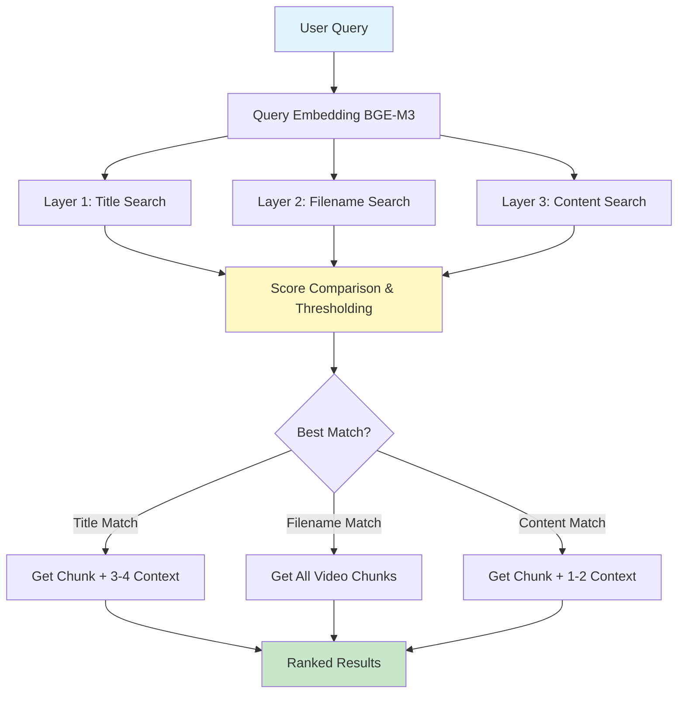

# Hierarchical Retrieval System - Architecture Overview

## 🎯 System Purpose

نظام استرجاع هرمي متقدم للمحتوى العربي التعليمي، يستخدم **3 طبقات منفصلة** من الـ embeddings لتحسين دقة البحث الدلالي.

---

## 🏗️ Architecture Components



---

## 📊 Three-Layer Embedding Strategy

### Layer 1: **Title Embeddings** (`embedding_type = "title"`)
- **Input**: `topicTitle` فقط
- **Purpose**: البحث في عناوين المواضيع
- **Threshold**: 0.65
- **Use case**: عندما يسأل المستخدم عن موضوع محدد بوضوح

### Layer 2: **Filename Embeddings** (`embedding_type = "filename"`)
- **Input**: `filename` فقط
- **Purpose**: تحديد الفيديو الأنسب كوحدة كاملة
- **Threshold**: 0.60
- **Use case**: عندما السؤال عام ويخص فيديو كامل

### Layer 3: **Content Embeddings** (`embedding_type = "content"`)
- **Input**: `topicContent` فقط
- **Purpose**: البحث العميق في المحتوى النصي
- **Threshold**: 0.55
- **Use case**: fallback أو عندما المحتوى أقرب من العنوان

---

## 🔍 Retrieval Logic (Priority Order)

```
1. Calculate scores for all 3 layers
2. Compare with thresholds:
   
   IF title_score ≥ 0.65 AND title_score is MAX:
      → retrieval_mode = "by_title"
      → Return: main chunk + 3-4 context chunks from same video
   
   ELSE IF filename_score ≥ 0.60 AND filename_score is MAX:
      → retrieval_mode = "by_filename"
      → Return: ALL chunks from matched video (ranked by similarity)
   
   ELSE IF content_score ≥ 0.55 AND content_score is MAX:
      → retrieval_mode = "by_content"
      → Return: main chunk + 1-2 context chunks
   
   ELSE:
      → retrieval_mode = "no_strong_match"
      → Return: top-k from content layer with warning
```

---

## 💾 Qdrant Schema

### Collection: `moshrif_knowledge_v3`

**Vector Config**:
- Size: 1024
- Distance: Cosine

**Point Structure**:
```python
{
    "id": int,  # unique point ID
    "vector": [float] * 1024,
    "payload": {
        "video_id": int,
        "filename": str,
        "telegram_url": str,
        "chunk_id": int | None,  # None for filename embeddings
        "chunk_title": str,
        "chunk_content": str,
        "embedding_type": "title" | "filename" | "content"
    }
}
```

---

## 🎲 Example Scenarios

### Scenario 1: Title Match
**Query**: "ازاي احفظ شغفي في البرمجة؟"

1. Title score = 0.78 ✅ (> 0.65, highest)
2. **Action**: Get chunk with title "كيفية الحفاظ على الشغف"
3. **Context**: + 3 nearby chunks from same video
4. **Mode**: `by_title`

### Scenario 2: Filename Match
**Query**: "ازاي مصر تبقى الهند في التكنولوجيا؟"

1. Filename score = 0.72 ✅ (> 0.60, highest)
2. **Action**: Get ALL chunks from matched video
3. **Ranking**: Sort by content similarity internally
4. **Mode**: `by_filename`

### Scenario 3: Content Match
**Query**: "يعني ايه cosine similarity؟"

1. Content score = 0.68 ✅ (> 0.55, highest)
2. **Action**: Get specific chunk explaining the term
3. **Context**: + 1-2 chunks for context
4. **Mode**: `by_content`

---

## ⚡ Performance Optimizations

1. **Batch Processing**: Insert embeddings in batches of 64
2. **Single Collection**: All 3 layers in one collection (filter by `embedding_type`)
3. **Metadata in Payload**: Avoid extra lookups
4. **Local Qdrant**: Embedded mode for speed

---

## 🔧 Tech Stack

- **Embedding Model**: BGE-M3 (1024-dim, Arabic-optimized)
- **Vector DB**: Qdrant (local/embedded)
- **Framework**: Python 3.10+
- **Libraries**: 
  - `qdrant-client==1.16.1`
  - `requests` (for embedding API)
  - `typing` (type hints)
